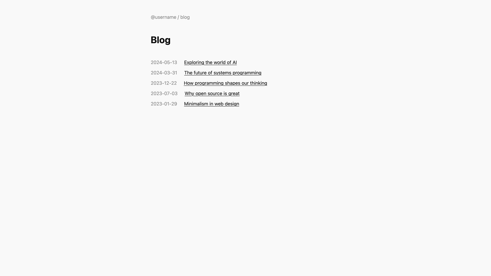
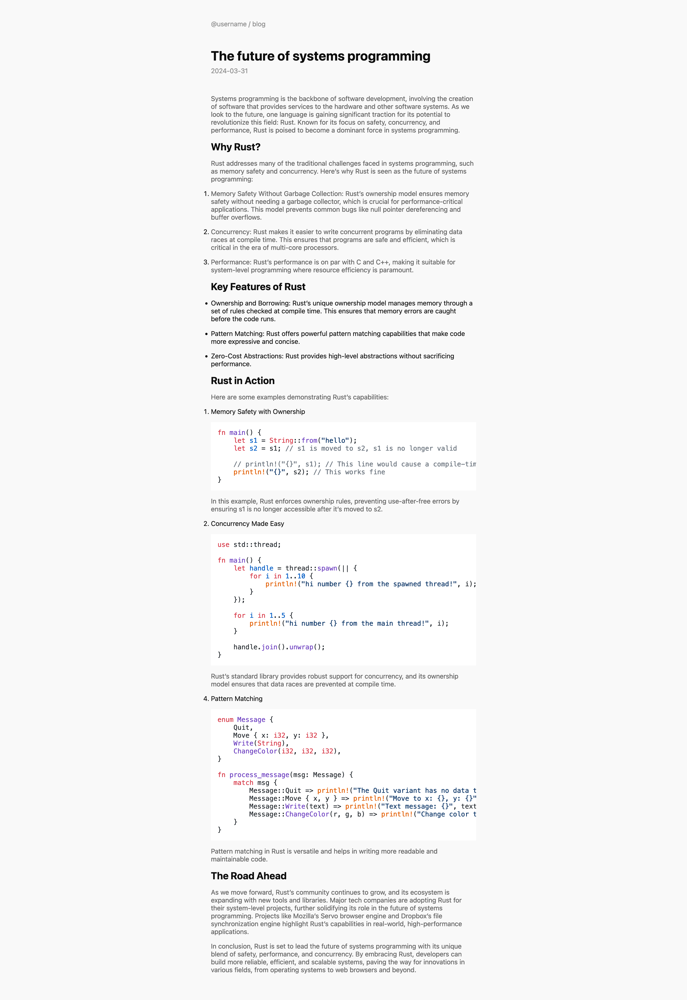

# Minimalist template

Minimalist is a simple, minimalist template for Stagnant. It is just a homepage with a list of your blog posts, which link to every individual blogpost. Take a look at some of the screenshots:

## Usage

The simplest way to use the minimalist template is to [download](https://github.com/legoraft/stagnant/releases/download/templates/minimalist.zip) and unzip it. You can also clone the git repository, where you'll have all the templates.

After downloading the template, upload the contents of the folder an empty git repository with `username.github.io`. You can write your posts in the `posts` directoy and your template will reside in the `template` directory.

You'll also likely want to edit the template to use your username. In the `template/index.html` change `username` to your username. Do the same thing in `template/posts/[id].html`.

To get your site up on github pages, you need to adjust the github pages settings. You can follow this [tutorial](https://docs.github.com/en/pages/getting-started-with-github-pages/configuring-a-publishing-source-for-your-github-pages-site#publishing-with-a-custom-github-actions-workflow) for this. You just have to change the "From branch" setting to "From action".